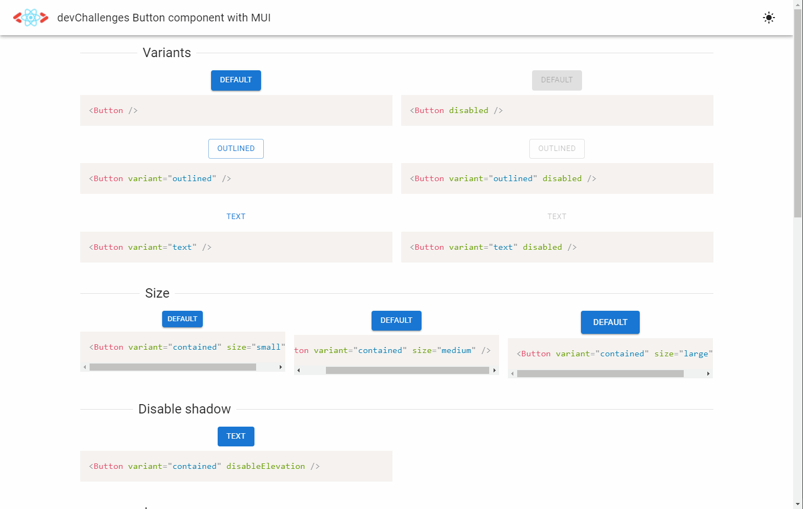

<h1 align="center">devChallenges Button component with MUI</h1>

<div align="center">
   Solution for a challenge from  <a href="http://devchallenges.io" target="_blank">Devchallenges.io</a>.
</div>



<div align="center">
  <h3>
    <a href="https://devchallenges-button-component-zeta.vercel.app/">
      Demo
    </a>
    <span> | </span>
    <a href="https://devchallenges.io/solutions/eoP1bcdcmNbjx8UhlcpS">
      Solution
    </a>
    <span> | </span>
    <a href="https://devchallenges.io/challenges/ohgVTyJCbm5OZyTB2gNY">
      Challenge
    </a>
  </h3>
</div>

<!-- TABLE OF CONTENTS -->

## Table of Contents

- [Table of Contents](#table-of-contents)
- [Overview](#overview)
- [Built With](#built-with)
- [Features](#features)
- [How To Use](#how-to-use)


## Overview

This application/site was created as a submission to a [DevChallenges](https://devchallenges.io/challenges) challenge. The [challenge](https://devchallenges.io/challenges/ohgVTyJCbm5OZyTB2gNY) was to build an application to complete the given user stories.


## Built With

- React
- TypeScript 
- [MUI](https://mui.com/)
- Sass
- ESLint & Prettier
- Many other tools and utilities from the [Create-React-App with Must-Have Libraries template](https://github.com/EliEladElrom/cra-template-must-have-libraries)


## Features

- Examples with code snippets of MUI Button, IconButton and LoadingButtons. Their variants and multiple options
- Light/Dark theme
- Scroll back to top

## How To Use

To clone and run this application, you'll need [Git](https://git-scm.com) and [Node.js](https://nodejs.org/en/download/) (which comes with [npm](http://npmjs.com)) installed on your computer. From your command line:

```bash
# Clone this repository
$ git clone https://github.com/Correia-jpv/devchallenges-button-component

# Install dependencies
$ npm install

# Run the app
$ npm start
```